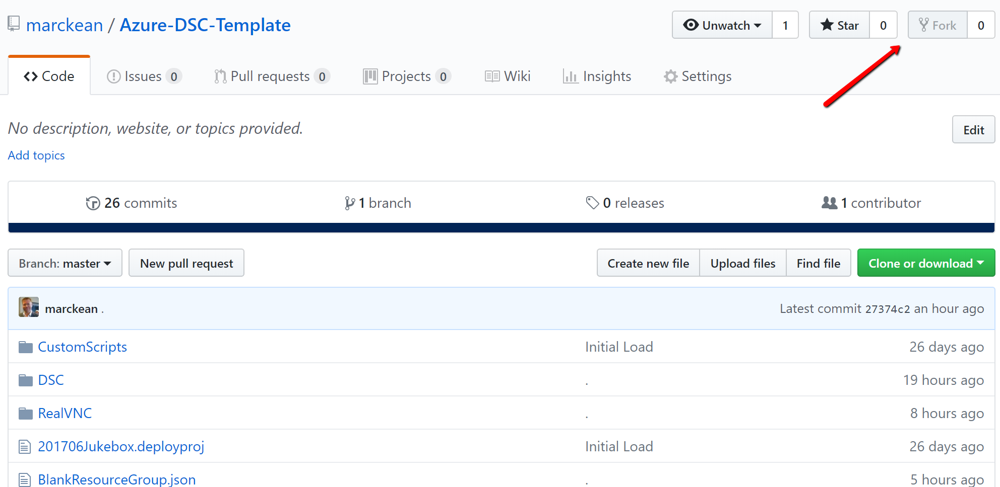
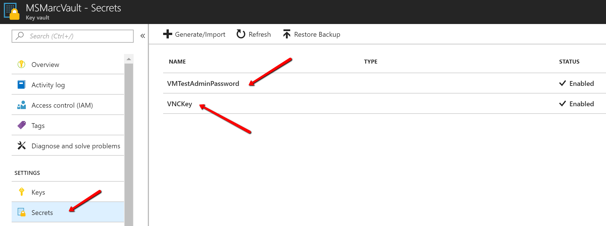
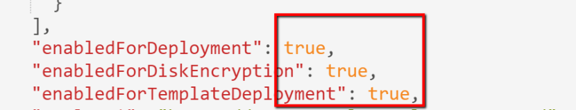
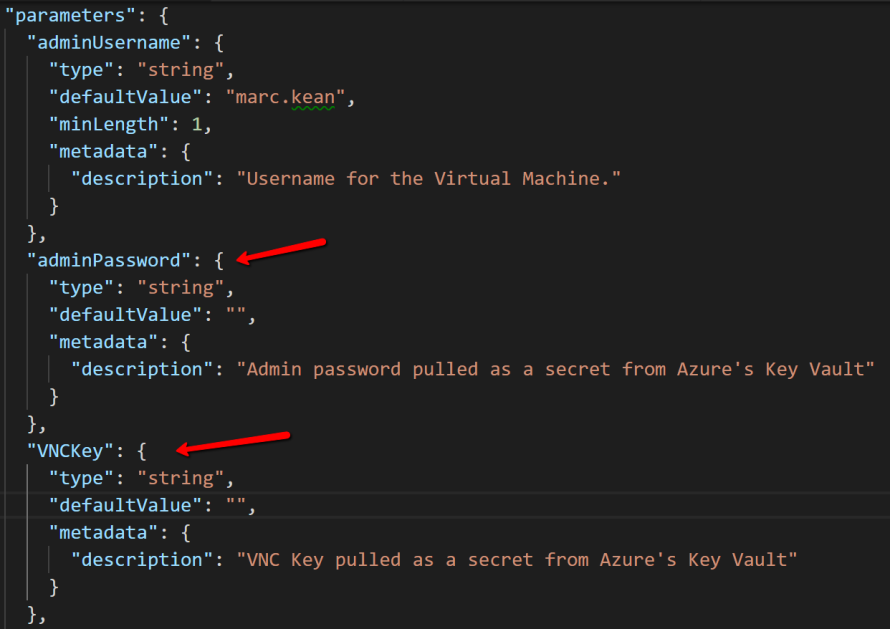
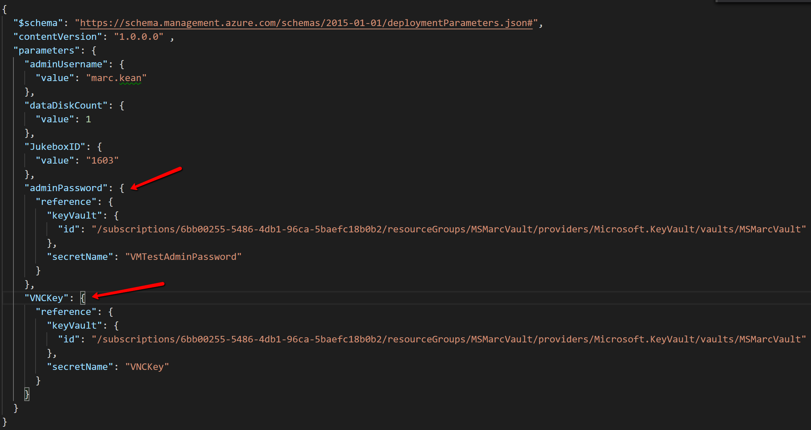
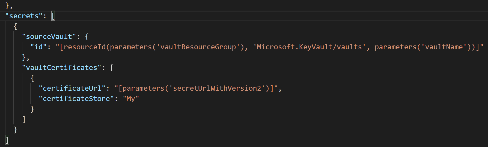
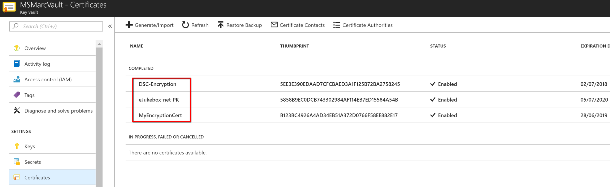

# Azure-DSC-Template

Details here https://marckean.com/2018/07/24/azure-dsc-deployment-using-a-json-template/

Basically

- Uses the **Microsoft.Resources/resourceGroups** method and deploys a Resource Group
- Deploys an Azure VM
- Deploys a vNet into a separate Resource Group (Cross Resource Group Deployment), a resource group used for shared resources
- Leverages the **Custom Script extension** which runs a script as the local computer account at the time of deployment. This script copies a script from the artifcats location to the local C:\ drive to be used as a user logon script. The DSC sets up a scheduled task to call the script at the time of any user logon.
- Leverages the Azure VM **DSC extension** to run the configuration on the VM. The JSON template also feeds parameter values into a DSC configuration script via the DSC extension

### This Repo:
- leverages the **DSC extension** to run the configuration on the VM. The JSON template also feeds parameter values into a DSC configuration script via the DSC extension

### [My other Repo](https://github.com/marckean/Azure-DSC-Automation)
- Leverages the **DSC extension** only to register the VM with the **Azure Automation** pull server in order for DSC to run the configuration on the VM.

You should:

- Fork my repo to your own GitHub account from GitHub’s website

- Using [Github desktop](https://desktop.github.com/), clone your newly forked repository to your local computer

- Then open the repository in **VS Code** – Open Folder

## Source Files – artifacts
Source Files / Build Files / Artifacts used in the process of DSC configuration has always been a challenge. Where to place them centrally so they’re accessible for all deployments. Source files can be other scripts, files, or software packages to install on your machines.

The best place I have found to store source files is in the local repo folder itself as part of the ARM deployment. At the time of deployment, all the files/folders will be uploaded as artifacts to a temporary blob storage account and a necessary blog storage SAS token is created automatically along with parameters, **$artifacts** & **$artifactsSasToken**.

## Keys, passwords & Secrets – Azure Key Vault
Sensitive information like passwords etc or Software licence keys used as part of a DSC initiated software installation, you would need to store these in Azure’s Key Vault.

Create a Key Vault of you don’t have one already. Then for the purpose of this blog, add the two secrets below, adding your own values.

To allow Azure services to be able to access Azure Key Vault, you’ll need to open it up to allow access.

Logon to https://resources.azure.com same as your Azure logon. Navigate through the levels to where your Key Vault is located…. Subscriptions > {Your Subscription} > resourceGroups > {Your Resource Group} > providers > vaults……

Select your Key Vault, then on the right select both **ReadWrite** & **Edit**.

At the very bottom, change the 3 items to say ‘true‘, then press the PUT button at the top to apply the settings.

## How are these passwords & secrets accessed by using a JSON template?
To create two parameters **adminPassword** & **VNCKey** as per my GIT repo, in the parameters section at the top of **WindowsVirtualMachine.json**, add in these parameters.

In the **WindowsVirtualMachine.parameters.json** file, add the same parameters while referencing the Secret name & Resource ID of your Key Vault.

## Certificates
This template in this blog post has the ability to import in a .PFX certificate.

**Certificates** are also kept in Azure’s Key Vault under Certificates.

Simply export a .PFX (Private Key) certificate from your computer.

  

